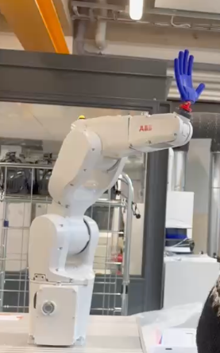

# Product Development Project - Heureka Robot Machine Vision

This repository provides a machine vision implementation for detecting human motions in real-time.




## Current Features
- **YOLOv8 for Person Detection**: Utilizes the YOLOv8 model to detect humans in real-time.
- **Motion Detection**: Detects moving gestures by analyzing motion within the bounding box of detected persons.
- **Flexible Input**:
  - Process live input from a webcam camera.
  - Process video files from a folder.
  - Process live input from an Intel RealSense camera.

## Setup
### Hardware
- A computer with a webcam camera.
- OR an Intel RealSense camera.

### Software
- Python 3.10+

### Python Dependencies
After cloning, please install the required Python packages by running this command:
```bash
pip install -r requirements.txt
```
Dependencies currently include:
- `opencv-python`
- `ultralytics`
- `pyrealsense2`
- `numpy`

## Usage
Currently, the script supports the following use cases:

### 1. Gesture detection from Intel RealSense camera or Webcam Camera
Run the following command:
```bash
python mediapipe_models/hand_gesture_recognizer.py
```

### 2. Motion detection from test videos
To process a folder of test videos (that are used as input to the model), follow these steps:
1. Place your video files in a folder (here it's `test-videos`).
2. Run the following command:

```bash
python with_stock_vid/main.py
```
The script will iterate through all video files in the specified folder and display the processed frames with motion detection results. .

## Main Structure of Repository
Currently, the repository structure is as follows:
```
├── models/                         # For classes that use machine learning models
│   ├── motion_detector.py          # Contains the MotionDetector class
│   ├── yolov8n.py                  # The YOLOv8 model for object detection
├── with_stock_vid/                 
│   ├── main.py                     # Main script with stock videos
│   ├── test-videos/                # Folder containing test video files     
├── with_camera/                    
│   ├── main.py                     # Script to run motion detection from camera
├── requirements.txt                # Python dependencies
├── README.md                       # Documentation (this file)
```

## Known Issues
- **Motion Detection Sensitivity**: Requires further fine-tuning of the motion detection threshold. The algorithm still needs to distinguish actual waving gesture to other motions.
- **Deprecated Warnings**: Some platforms may show warnings for deprecated camera APIs.
- **Intel RealSense SDK Installation**: Ensure `pyrealsense2` is installed correctly for live camera input.


## Acknowledgments
- YOLOv8 model by [Ultralytics](https://github.com/ultralytics/yolov8). Key features of YOLOv8 model [here](https://docs.ultralytics.com/models/yolov8/#key-features-of-yolov8)
- Intel RealSense SDK for Python


